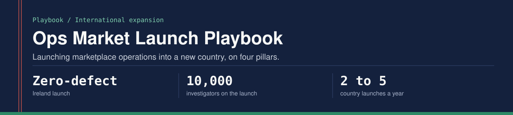
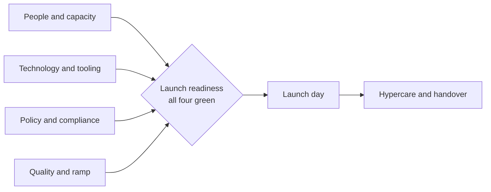

A framework for launching marketplace operations into a new country.

Built from leading Amazon Seller Protection's international launches across Belgium, South Africa and Ireland, where I built the expansion playbook from scratch and stood up a launch team that remains live and still scaling.

## Results

| Metric | Result |
|---|---|
| Ireland launch | Zero-defect, to 10,000 investigators |
| Ireland scope | 150 workflows, 100+ features, 1,000+ policy localizations and translations |
| Ireland contact center | Stood up as a service as part of the launch |
| Launch cadence | From two country launches a year to five |

## The problem this solves

Most operations teams treat a market launch as a project: a checklist with a go-live date. That is why launches have defects.

A launch is a system design problem. You are standing up a new operating model (people, technology, policy and quality) in a context you have never operated in, often under regulatory scrutiny and usually against a fixed date.

## The four pillars

All four have to be ready on the same day. One missing pillar is a launch defect.

| Pillar | What has to be true |
|---|---|
| People and capacity | Headcount model, training ramp and organization structure agreed |
| Technology and tooling | Every feature validated, integrations tested, fallback procedures written |
| Policy and compliance | Policies localized and translated, legal sign-off in hand |
| Quality and ramp | Quality baseline, ramp curve and error-tolerance threshold defined |

Track each pillar on its own red, amber and green status and converge them on launch day. Nothing launches with an unmitigated red.

## 1. People and capacity

- How many investigators on day one, and how many once volume settles?
- What is the ramp curve to proficiency in a new market?
- How do you staff when the volume forecast is unreliable?

New-market forecasts are always wrong. Staff to a range, not a point estimate, and decide in advance what triggers the contingency.

## 2. Technology and tooling readiness

Validate by category: core workflow tools, language and localization, reporting, integration dependencies, and manual fallback procedures. Readiness is binary on launch day. It works or it does not.

## 3. Policy localization

1. Inventory every policy that applies to the new market
2. Separate what needs localization from what applies directly
3. Legal review of the high-risk changes
4. Translation, checked for both language and operational accuracy
5. New policies built into pre-launch training
6. Dual sign-off from legal and operations before launch

Regulatory and privacy requirements were owned by legal and privacy teams. The program's job was to put their reviews on the launch timeline first, because those reviews constrain everything else.

## 4. Quality and ramp

- Tiered quality targets from day one to steady state
- An error-tolerance threshold that pauses the launch
- A daily quality pulse in the first weeks, not a weekly one

Quality problems in a new market are almost always training gaps. When errors spike, look at the training content before the staffing.

## 5. The run-up to launch

1. Pillar leads confirm green or escalate reds
2. Full dress rehearsal on live systems
3. No-go criteria defined and signed by every Director
4. Final readiness review with senior leadership
5. Hypercare team activated
6. Launch, with a real-time monitoring view
7. First retrospective, then a quality and productivity review once the market settles

## Lessons

1. The playbook is the alignment tool. When teams define ready differently, it makes readiness objective.
2. Zero-defect means zero unmitigated problems. Every launch has surprises; the aim is that none becomes a failure.
3. Regulatory review is a timeline risk, not only a legal one. Map it first.
4. Train the trainers. A large launch cannot be trained directly.
5. Design the handover. The launch team moves on and the steady-state team inherits.

## Common failure modes

| Failure | Root cause | Prevention |
|---|---|---|
| Launch-day volume overwhelms the tools | Load testing skipped | Load test above forecast volume |
| Investigators cannot find policies | Localization incomplete | Policy search tested before launch |
| Quality below baseline after launch | Training ramp underestimated | More supervised production time |
| Regulatory finding after launch | Legal review too late | Legal in the room from the start |
| Key people leave after launch | Burnout | Rotate the hypercare team |

## What I did and did not do

I built the playbook, led the launches and stood up the launch team. Legal and privacy teams owned the regulatory work, and engineering teams built the tooling; I do not write or review application code.

## Author

Prateek Ratnakar. AI transformation and program leader; 12 years, nine of them at Amazon (May 2017 - Jun 2026), as Senior Program Manager in Amazon Seller Protection.

Amazon North Star Award (2025 and 2021) | Business Leader of the Year (2019) | IIT (BHU) Varanasi | IIM Bangalore

[Portfolio](https://prateek-ratnakar.github.io) | [LinkedIn](https://www.linkedin.com/in/prateekratnakar) | [GitHub](https://github.com/prateek-ratnakar)

Every figure here matches my resume, my portfolio and my interview answers. The content is generalized; no proprietary systems, data or code are included.
